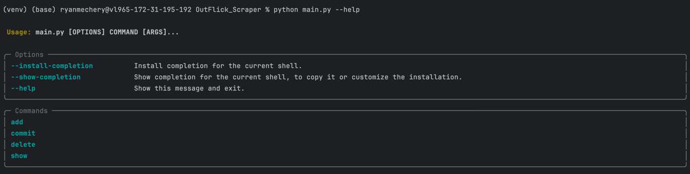
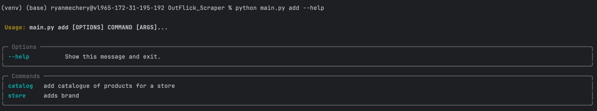

# OutFlick Scraper

This is a package that fetches product data from websites like Uniqlo and Zara and formats
them into a data model that can easily be added to a SQL database.

This package also features a CLI tool to easily manage raw JSON data and parses in a SQLite file to manage parsing 
for versioning and committing to a remote database.

## Disclaimer

Please note I am not responsible for what anyone does with these parsers. 
This package is for educational/demonstrative purposes only.

## Unified Data Model

You can view more details about the data model here: https://dbdocs.io/ryanmechery/OutFlick. 

## CLI Documentation

The CLI tool allows you to test and create multiple parsers before you commit to a remote database.

If you run `python main.py --help` it will show the list of commands available.

### `add`
With the `add` command you can add either a new store to parse or a catalog of products for a given day.

Store refers to the entirety of the parsed data for a given brand and catalog refers to a subset of the store products. 

### `add catalog`
With the `add catalog` command you must provide the store_alias like 'Uniqlo' and a uniquely identifiable alias for 
the given catalog parse. 

You can also optionally add comments for the catalog like "Catalog of men's products". 

### `add store`
With the `add store` command you must provide the brand like 'Uniqlo' and a uniquely identifiable alias for 
the given parse like 'Uniqlo_09_05_2024'. 

You can also optionally add comments for the catalog like "Product data for 09/05/2024". 

### `show`
With the show command you can see a terminal preview of the data for a list of brands, a given store, and a catalog.

#### `show stores`
You can see a list of stores and the time they were scraped. 

#### `show store`
For a given alias you can see the data fetched from that raw parse.

#### `show catalog`
This shows a list of parses that have been recently committed.

### `commit`
This command will allow you to commit local data in SQLite database to a remote SQL database.

### `delete`
This command will allow you easily delete local parsed data using an alias.

